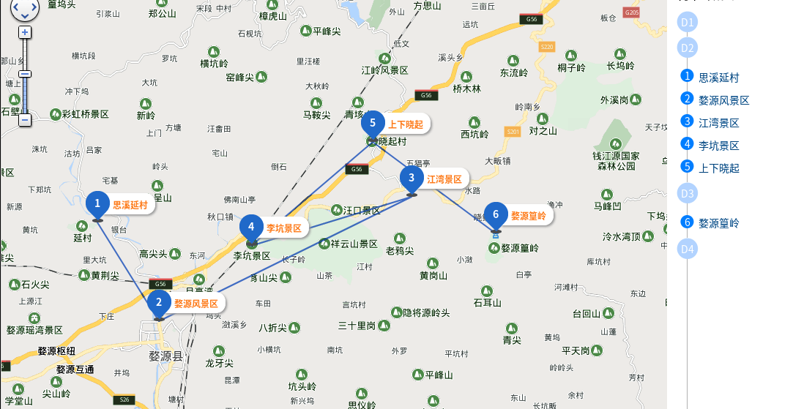

# 景点：
* 婺源景点:江湾(4A景区)、灵岩洞(4A景区)、大鄣山卧龙谷(4A景区)、文公山(4A景区)、李坑、思溪延村、汪口、百柱宗祠、江岭、彩虹桥、晓起 *10多个景点联票*
* 其他著名景点：篁岭，月亮湾、漂流。
* 周边景点：景德镇，三清山，庐山。

# 时间：
* 每年3月中下旬到4月看油菜花，10-12月婺源赏秋景
* 石城的红叶，晓起的皇菊，篁岭的晒秋

# 景点介绍：
* 婺源江岭：
  
  * 看油菜花最好就去江岭，有两种看法：
     1. 一种是梯田式的，层层叠叠，高低错落，非常壮观；
     2. 一种是与徽派建筑的结合，朵朵金黄色的油菜花，掩映着白墙灰瓦的徽派建筑，让人醉心于这一片浑然天成的自然画卷；
     而江岭的一号和二号观景台，就是这两种婺源美景的真实写照，这里每年的三四月份过来赏油菜花。
  * 交通：
     1. 江岭山下有观光车（免费），可以乘坐至一号观光台（最高点）。步行下山至二号观光台，可乘坐观光车（免费）下山，下山后就出了检票口了，若想领略沿途风光，建议步行下山。
     2. 上山顶需要乘坐景区的大巴，最早是早上7点才有大巴。这里是盘山公路，一路观看沿途风景还是很不错的，到山顶后，俯视远方，山下的层层梯田如链似带，高低错落，壮丽雄齐而梯田的四周围绕着青山，与油菜花的金黄、民居的素白构成了一副极美的婺源农村风光画卷。
  * 门票是60元，24小时都有售票的
* 篁岭古村：
  * 看点：晒秋
    
    在秋收之前，去看婺源篁岭晒秋是最好不过了，这里秋天收获的农作物和瓜果蔬菜特别多，让你看得眼花缭乱，美不可言语，成了篁岭晒秋最美的一道风景线。 在篁岭，一年四季各有所晒，绵延有序，因秋日作物丰盛而被称为“晒秋”。每当日出山头，晨曦映照，整个山间村落饱经沧桑的徽式民居土砖外墙与晒架上、圆圆晒匾里，五彩缤纷丰收果实组合便绘就出世界独一无二的“晒秋”民俗景观。篁岭属于4A景区，这里；；这里秋天就是晒秋的地方，梯田区主要是春天拍摄油菜花的地方，秋天没有人去
   * 交通：
  
      婺源县城车站有直接去篁岭的班车，自驾从江湾高速口下一路都有指示牌，也可以直接导航篁岭景区；在山脚下游客中心买完票，要乘索道上到山顶，山顶有梯田去和古村游览区
   * 门票：
  
      单票：145元/（篁岭成人票+缆车），联票：325元（婺源12点联票+篁岭成人票+缆车）*仅供参考*
  
* 石城村：
  
  * 看点：城墙，枫树，秋景
  
    石城村位于婺源县西北的古坦乡境内，村头有石壁，岩如古城，危耸的城“墙”内外有许多古树名木，其中最让人惊叹的就是这里的百来棵枫树，每棵树高都在35米以上，远远超过村里的高矮屋顶，和巨大而且笔直向上的树冠相比，黑瓦白墙简直就是玩具屋子。这里是婺源县拍摄秋景的 好地方之一，每年一到11月中下旬，这里枫树开始变红，就会有人从凌晨拍到黄昏。清晨雾气或炊烟中的火红枫树简直就美得不像人间植物了。灰白的民居与枫林交相辉映，形成了秋季婺源乡村别样的风光。所以每年深秋，石城的秋色非常的浓郁，因此吸引了各地踏秋和摄影写生的爱好者前来拍摄，这里每年摄影也成为了一大亮丽风景线。
  * 门票：
    
    免费，周一至周五（全天开放）。

* 月亮湾：
  * 看点： 江心洲如一轮眉月
  
    婺源月亮湾在婺源县东北部秋口镇金盘村附近。婺源月亮湾是因江中有一江心洲如一轮眉月而得名。它依山伴水，水面平静如镜。眼望去一湾湖水如弯月，一弯黄绿的月亮静卧水面，袖珍的小岛，翠绿的湖水，静谧流淌。这里适合早上和黄昏拍摄照片。
  * 交通：
  
    离县城不远，仅仅3公里，可以坐班车或者打车前往，自己开车也可以。但是如果要去观景台拍摄的话，要收15-20块过路费，如果想坐船的话需要30-50块
  * 门票：
    
    无需门票
* 长溪村：
  * 简介：
  
    赏秋的必来之地。
    位于婺源山区，地处极其僻远，道路比较难走。有着千年历史的原生态古村落，每到深秋，村庄前后有二百多株连片生长几百年的香枫树就会一片火红，高大的红枫与白墙黑瓦马头墙掩映为一体， 形成别具特色的红枫林景观。
  * 交通：  
  
    1. 从婺源县城坐班车前往。
    2. 驾车直接导航婺源长溪村。
  * 门票：
    
    无需门票。

* 菊径村:
  * 简介：
  
    位于婺源县城边上，菊径村是一个典型的山环水绕的古村落，毗邻国家森林公园灵岩洞和著名的"枫景"摄影地石城。小河呈大半圆形，绕村庄将近一周，四周为高山环绕，站在村对面公路旁山腰上，俯瞰村庄全景，就是一个大大的"圆"形。
  * 交通：
    1. 县城直达菊径的班车。
    2. 驾车直接导航到菊径村。
  * 门票：
  
    不需要门票，观景台拍摄，需要20块钱。

* 李坑：
  * 简介：
  
    位于婺源县城12公里边上，以李姓聚居为主的古村落，有乌镇的建筑景观，又有兔耳岭怪石景观，是婺源的4A景区，距离县城最近的一个景点。李坑的建筑风格比较独特，属于徽文化古村落，给人一种安静和祥和的感觉。粉墙黛瓦，景色错落有致。有很多美食，比如:李坑炙肉、花菇石鸡、清焖荷包鲤和李坑蒸鸡等等。
  * 交通：
    
    无，任意。
  * 门票： 
  
    每人60块。开放时间 7:30-17:30

* 大鄣山卧龙谷：
  * 简介：

    位于婺源大鄣山内，也称“三天子鄣”。
    * 春季看：山花烂漫。
    * 夏季看：郁郁葱葱。
    * 秋季看：红枫尽染。
    * 冬季看：冰雕玉砌。
  
    景区四季变换不同的色彩，高山峡谷里瀑布成群。号称“江南第一奇谷”，以雄、险、奇、秀而著称。
  * 交通：
  
    无
  * 门票：
  
    每人60块，开放时间是8:00-17:00。

* 灵岩洞：
  * 简介：

    婺源的一个灵岩洞森林公园，集自然与人文景观为一体的风景名胜区，灵岩洞国家森林公园主要分为灵岩洞群景区、石城古树名木景区、生态茶园景区。是4A景区，里面有许多著名的景点。
  * 交通：

    无
  * 门票：

    每人50块

* 思溪延村：
  * 简介：
  
    位于婺源县思口镇，有明清古建筑，属于古村落。整体色彩效果是黑白相间，给人朴素 淡雅的美感。村落内以青石板铺地，古建群 背靠青山，面临清溪和稻田，四周都是绿地，村庄与秀水青山的 优雅自然风光融为一体。有著名的祠堂，聪听堂、明训堂和余庆堂，古建筑和稻田融为一体，非常的有诗书画意。

  * 交通：
  * 门票：

* 彩虹桥：
  * 简介：
  
    位于婺源清华镇，一种颇有特色的桥——廊桥，所谓廊桥就是一种带顶的桥，这种桥不仅造型优美，最关键的是可在雨天里供行人歇脚。彩虹桥周围景色优美，坐在这里稍作休憩，浏览四周风光，会让人深深体验到婺源之美。适合夏天坐船玩赏。
  * 交通：
  * 门票：

    每人60块

* 晓起村：
  * 简介：
  
    位于婺源县，多为清代建筑，是典型的徽派古生态民俗文化村，既有周庄的小桥流水，又有香格里拉的宁静悠远，更有古朴纯实的民风民情。建筑风格各具特色，村中小巷均铺青石，曲曲折折，回环如棋局。
  * 交通：
  
    这里离县城约20公里
  * 门票：

    每人60块

# 位置分布
